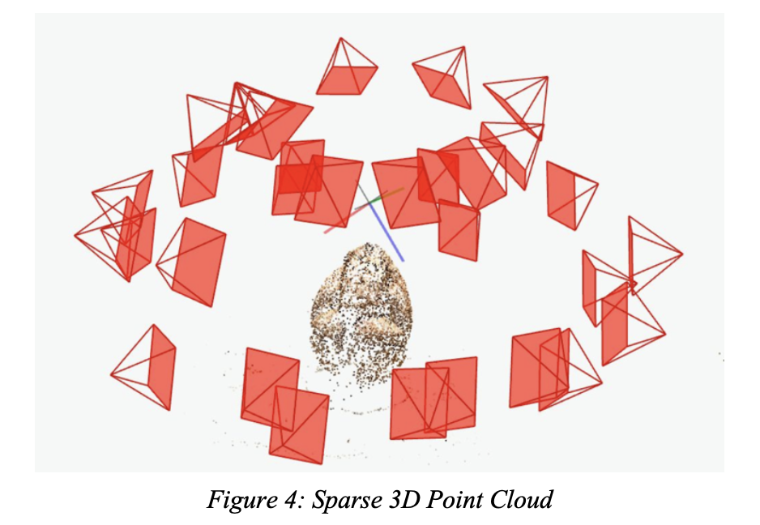
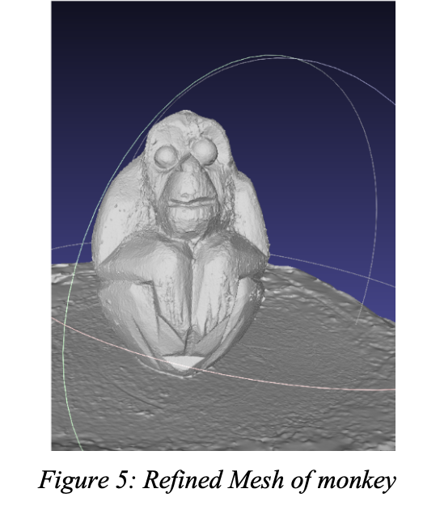
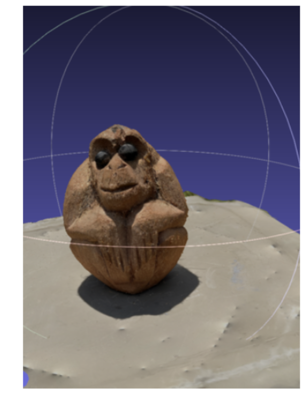
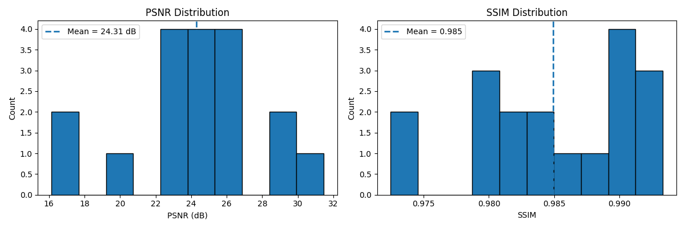

# ReconStructAI3D: 3D Reconstruction through Segmentation and Multi-View Imaging

ReconStructAI3D is a modular 3D reconstruction pipeline that transforms multi-view images into high-quality textured meshes using:

- Automated segmentation via Meta AI’s Segment Anything Model (SAM)
- Sparse and dense reconstruction with COLMAP (SfM)
- Mesh densification, refinement, and texturing using OpenMVS

This system has been tested on real-world scenes (e.g., monkey figurine, chair) captured via iPhone 14 Pro (LiDAR-supported).

---

## Pipeline Overview

```
images/ ➝ masks/ ➝ COLMAP (sparse) ➝ OpenMVS (dense + mesh) ➝ evaluation.py ➝ PSNR/SSIM
```

## Usage

This project performs 3D reconstruction of real-world objects using COLMAP + OpenMVS along with automated segmentation via Segment Anything (SAM). Below is the step-by-step pipeline to reproduce the results:

### 1. Image Capture
Capture multiple images of an object (e.g., a chair or monkey figurine) from different angles (360 degree) using a phone camera, ~20–40 photos of your object (e.g., a statue or furniture) in 360° using a smartphone.

Place them in data folder.

### 2. Generate Object Masks using SAM

Run the following script to auto-generate binary masks for all images using Segment Anything (SAM):

`python scripts/Mask_Generation/processMask.py`
This would create:
- data/Chair/mask_out/
- data/Monkey/mask_monkey/

Note:
The pre-trained weights for SAM (e.g., sam_vit_h_4b8939.pth) are not included in this repository due to licensing restrictions.
Please download the appropriate weights manually from the official SAM repository and place them in `scripts/Mask_Generation/weights/`

### 3. Sparse Reconstruction (COLMAP)

Use COLMAP to generate the sparse 3D point cloud from your input images and SAM-generated masks.

Note: COLMAP must be installed and configured (either system-wide or via Docker). Masks should be in the same folder as the images or referenced correctly in your database setup.

You can launch COLMAP either via GUI or command-line:
 `colmap gui`.

Steps:
	1.	Create a new project.
	2.	Import images and masks.
	3.	Run Feature Extraction.
	4.	Run Feature Matching.
	5.	Run Sparse Reconstruction (Mapper).
	6.	Export the sparse model.

Run the following COLMAP commands step-by-step (for automation):

```
# Feature extraction
colmap feature_extractor \
    --database_path data/Chair/colmap/database.db \
    --image_path data/Chair/images \
    --mask_path data/Chair/mask_out \
    --ImageReader.single_camera 1

# Feature matching
colmap exhaustive_matcher \
    --database_path data/Chair/colmap/database.db

# Sparse reconstruction
colmap mapper \
    --database_path data/Chair/colmap/database.db \
    --image_path data/Chair/images \
    --output_path data/Chair/colmap/sparse
```

I observed an important thing that was ensuring that image camera parameters are correctly embedded or set before mapping.

You would be able to see something like below:


### 4. Dense Reconstruction and Meshing with OpenMVS

After generating the sparse point cloud with COLMAP, convert it and continue the pipeline using OpenMVS for dense reconstruction, mesh generation, and texturing.

> **Requirement**: OpenMVS must be installed and accessible from your terminal.

#### Step 1: Convert COLMAP model to OpenMVS format
```
InterfaceCOLMAP \
    -i sparse/0/ \
    -o scene.mvs \
    --images-path images/
```

#### Step 2: Densify the point cloud

```
DensifyPointCloud \
    scene.mvs \
    --resolution-level 1
```

#### Step 3: Reconstruct the surface mesh
```
ReconstructMesh \
    scene_dense.mvs
```

#### Step 4: Refine the mesh
```
RefineMesh \
    scene_dense_mesh.mvs
```

Below is the example:


#### Step 5: Apply texture to the mesh
```
TextureMesh \
    scene_dense_mesh_refine.mvs
```
Below is the example of final textured image


Output: A textured 3D mesh of your object scene saved in .obj or .ply format.
Use MeshLab to visualize or export the final textured model.

### 5. Evaluate Reconstruction Quality (PSNR & SSIM)

We evaluate the visual fidelity of the reconstructed 3D models by comparing rendered outputs to reference images using PSNR (Peak Signal-to-Noise Ratio) and SSIM (Structural Similarity Index).

#### Step 1: Prepare evaluation data
Organize the folder with ground truth images and the reconstructed files in a folder

#### Step 2: Run the evaluation script

`python scripts/evaluation.py`

Output:
	•	A CSV file: depth_metrics.csv containing PSNR and SSIM scores for each scene (e.g., chair here).
	•	A plotted graph below shows side-by-side metrics and visualizations.



 In our test case (Chair), we achieved:
-	PSNR: ~24.3 dB
-   SSIM: ~0.985

These results indicate high structural similarity and decent texture fidelity between the reconstructed and ground-truth imagery.

Install dependencies:
`pip install -r requirements.txt`

#### Credits
-	SAM: Meta AI – Segment Anything https://github.com/facebookresearch/segment-anything
-	COLMAP: ETH Zurich – COLMAP GitHub https://github.com/colmap/colmap
-	OpenMVS: Open Multi-View Stereo Library https://github.com/cdcseacave/openMVS

### License
This project is for academic/research demonstration purposes only. SAM weights are not redistributed — due to original licenses.

